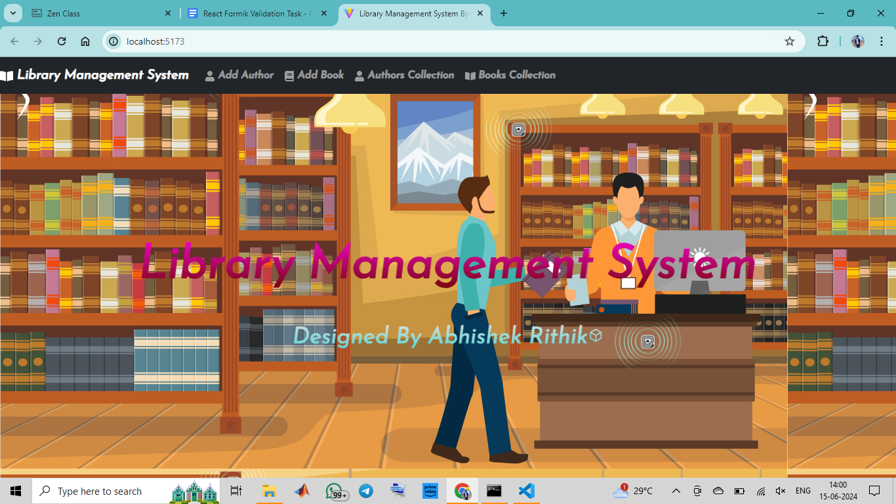

# Library Management System
Welcome to the Library Management System, a web application designed to help manage your library's books and authors.

# Library Management System

# Features
1.Add and manage books, including titles, authors, ISBN numbers, and publication dates.
2.Add and manage authors with their names, birthdates, and biographies.
3.View collections of books and authors.
4.Edit existing book and author records.
5.Delete books and authors from your library.
# Demo
You can try out the application live on Netlify.

# Technologies Used
* React: A JavaScript library for building user interfaces.
* React Router: For handling client-side routing.
* React Bootstrap: A popular Bootstrap framework integration for React.
* Formik: A form library for React to simplify form handling.
* Yup: A schema validation library for form validation.
* Netlify: For hosting the application.

# Installation
Clone the repository:

cd library-management-system
Install dependencies:

npm install
Start the development server:
npm start
Open your browser and visit 

# Usage
* Use the navigation bar to access different sections of the application:

1."Add Author" to add and manage author details.
2."Add Book" to add and manage book details.
3."Authors Collection" to view and manage the collection of authors.
4."Books Collection" to view and manage the collection of books.
5.Click "Edit" to edit existing author or book records.
6.Click "Delete" to remove author or book records.